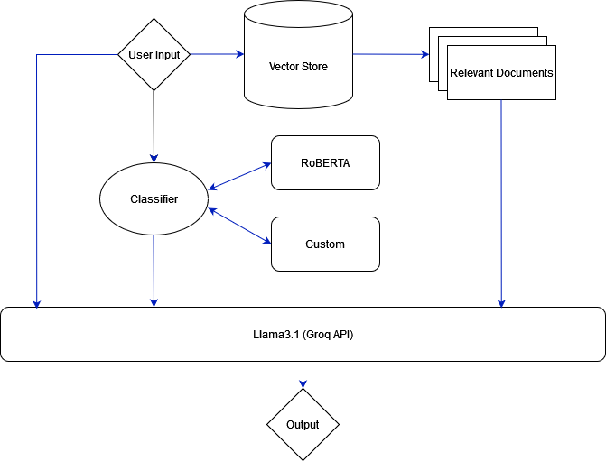

# email-management

This project is part of the AI/ML Engineer- Technical Assignment from SmartSense Consulting Solutions PVT LTD.

Author's info
```bash
Pulkit Gautam
Computer Science and Engineering 
Bachelor of Technology (B.Tech)
Indian Institute of Technology Gandhinagar
```

The RoBERTA classification model can be viewed at [HuggingFace_Hub](https://huggingface.co/pulkitgautam/email-classifier)


## Repository Structure
The repository has been divided into:

**data** : Contains datasets and documents needed for training and fine-tuning models.

**src** : Includes the source code and utility scripts necessary to build and run the application.

## Setting Up the Conda Environment

### Step 1: Download and Install Conda
If you don't already have Conda installed, download and install it from [the official website](https://docs.conda.io/en/latest/miniconda.html) for Miniconda, or [Anaconda](https://www.anaconda.com/products/distribution) for the full Anaconda distribution.

### Step 2: Create a Conda Environment
1. Open your terminal or command prompt.
2. Navigate to the project directory.
3. Create a new Conda environment with Python 3.10:

    ```bash
    conda create --name myenv python=3.10
    ```

4. Activate the newly created environment:

    ```bash
    conda activate myenv
    ```

### Step 3: Install Dependencies
With the environment activated, install the required dependencies listed in the `requirements.txt` file:

```bash
pip install -r requirements.txt
```

### Step 4: Setting-up Environment Variables
Create a .env file in the root directory of the repo and set your GROQ_API_KEY.
```bash
touch .env
```

```python
GROQ_API_KEY="YOUR API KEY"
```

To get your own api key visit [Groq Cloud](https://console.groq.com/keys).

### Step 4: Run the App

```bash
python -m streamlit run ./src/app.py
```

### Step 5: Run Docker App

```bash
docker run -p 8501:8501 streamlit-app
```

## Architecture and Models Used
`roberta_base` model from huggingFace hub is used and finetuned for Sentiment Analysis.

```python
model_id = "roberta-base"
model = RobertaForSequenceClassification.from_pretrained(model_id, config=config)
tokenizer = RobertaTokenizerFast.from_pretrained(model_id)
```



### Model Overview
RoBERTa, developed by `Facebook AI`, has achieved state-of-the-art results on numerous NLP benchmarks, including sentiment analysis. Its architecture is designed to improve upon the original BERT model by using `dynamic masking`, which allows it to generalize better and learn richer language patterns. This capability significantly enhances its performance on sentiment analysis tasks

### Finetuning Process
Fine-tuning is carried out using the `Trainer` class from the Hugging Face library, which simplifies the process of training models. This class handles various aspects of the training loop, allowing for efficient model optimization and evaluation.

### Embedding Generation
To generate embeddings for documents and queries, we use the `all-MiniLM-L6-v2` model from the Sentence Transformers library. This model is known for its high performance in generating effective embeddings, making it suitable for tasks that require semantic understanding of text.

### Retrieval-Augmented Generation

Retrieval-Augmented Generation (RAG) is an effective technique designed to address several limitations associated with large language models (LLMs), including issues related to knowledge cutoffs. By integrating retrieval mechanisms with generative capabilities, RAG enhances the model's ability to access and incorporate up-to-date information during the generation process.

In this implementation, I have utilized `ChromaDB` as the vector store for retrieving relevant documents. This choice allows for efficient storage and retrieval of embeddings, enabling the model to access pertinent information dynamically and improve the quality and relevance of generated responses.

### Web UI

The web interface for this application is built using Streamlit, a powerful framework for creating interactive applications tailored for machine learning and deep learning projects. Streamlit simplifies the process of designing and deploying web applications, allowing for rapid prototyping and seamless integration of data visualizations, model outputs, and user inputs.